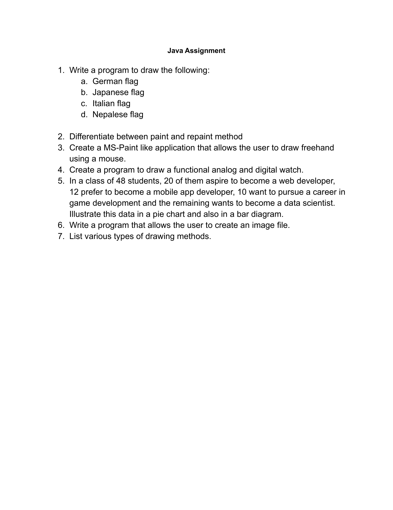

# Java Assignment: Network Programming 

# Question

# Question no.1:- Write a program to draw the following:
- # a) German Flag
- # b) Japanese Flag
- # c) Italian Flag
- # d) Nepalese Flag

Answer:-

**NEPALESE FLAG:-** "[Nepal.java](https://github.com/dhunganaPradeep/Java/blob/main/Assignments/Graphics/Nepal.java)"

**GERMAN FLAG:-** "[German.java](https://github.com/dhunganaPradeep/Java/blob/main/Assignments/Graphics/German.java)"

**ITALIAN FLAG:-** "[Italy.java](https://github.com/dhunganaPradeep/Java/blob/main/Assignments/Graphics/Italy.java)"

**JAPANESE FLAG:-** "[Japanese.java](https://github.com/dhunganaPradeep/Java/blob/main/Assignments/Graphics/Japanese.java)"

# Question no.2:- Differentiate between paint and repaint() method.

Answer:-

 | Paint  | Repaint |
| ------------- | ------------- |
| Transmission control protocol |User datagram protocol |
| TCP is a connection-oriented protocol. Connection-orientation means that the communicating devices should establish a connection before transmitting data and should close the connection after transmitting the data. | UDP is the Datagram-oriented protocol. This is because there is no overhead for opening a connection, maintaining a connection, and terminating a connection. UDP is efficient for broadcast and multicast types of network transmission. |
|TCP is reliable as it guarantees the delivery of data to the destination router.  |The delivery of data to the destination cannot be guaranteed in UDP. |
|	TCP is comparatively slower than UDP.  |UDP is faster, simpler, and more efficient than TCP.  |
| TCP is mainly used in data sensitive application.  | UDP is mainly used in time sensitive application. |
| Header Size is 20-bytes.  | Header size is 8-bytes.  |
| TCP follows threeway handshake concept  | UDP doesn't wait for the acknowledgement.  |
| Performs errorchecking by using checksum.  | Doesn't perform errorchecking. |
|Example :- Web Browsing, email etc.  | Example :- DNS, VOIP, line-data streaming |

# Question no.3 :- Create a MS_Paint like application that allows the user to draw freehand using a mouse.

Answer:-

 "[PaintProgram.java](https://github.com/dhunganaPradeep/Java/blob/main/Assignments/Graphics/PaintProgram.java)"  

# Question no.4:-  Create a program to draw a functional analog and digital watch.

Answer:- 

**ANALOG WATCH:-** "[AnalogWatch.java](https://github.com/dhunganaPradeep/Java/blob/main/Assignments/Graphics/AnalogWatch.java)"

**DIGITAL WATCH:-** "[Digital.java](https://github.com/dhunganaPradeep/Java/blob/main/Assignments/Graphics/Digital.java)"

  
# Question no.5:-   In a class of 48 students, 20 of them aspire to become a web developer, 12 prefer to become a mobile app developer, 10 want to pursue a career in game development and the remaining wants to become a data scientist. Illustrate this data in a pie chart and also in a bar diagram..

Answer:- 
**PIE CHART:-** "[PieChart.java](https://github.com/dhunganaPradeep/Java/blob/main/Assignments/Graphics/PieChart.java)"

**BAR DIAGRAM:-** "[Bar.java](https://github.com/dhunganaPradeep/Java/blob/main/Assignments/Graphics/Bar.java)"

# Question no.6:- Write a program that allows the user to create an image file.

Answer:- "[CreateImage.java](https://github.com/dhunganaPradeep/Java/blob/main/Assignments/Graphics/CreateImage.java)"

## Output :
           **PNG Image** 
            **JPG Image** 

# Question no. 7:- List Various type of Drawing methods.

Answer:-

**Steps to create the TCP Client and Server :**

## TCP Server:

- Create a ServerSocket object by providing a port number to listen to incoming client connections.
- Call the accept() method on the ServerSocket object to block and wait for a client to connect. This method returns a Socket object.
- Create an input and output stream for the socket to communicate with the client.
- Use the input stream to read data sent by the client and use the output stream to send data to the client.
- Close the socket and release the resources when the communication with the client is complete.

## TCP Client:

- Create a Socket object by providing the IP address and port number of the server to connect to.
- Create an input and output stream for the socket to communicate with the server.
- Use the output stream to send data to the server and use the input stream to read data sent by the server.
- Close the socket and release the resources when the communication with the server is complete.

