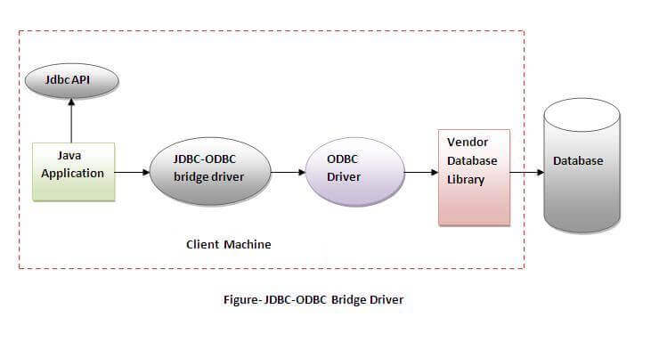

# Java Assignment: Chapter 1 & 2

# Question

# Question no.1:- Discuss the features of JavaDefine JDBC drive. Explain its types.

Answer:-

   JDBC (Java Database Connectivity) driver is a software 	component that enables Java applications to interact with a 	database. 
    • It allows Java code to execute SQL statements and retrieve results from a database.
    • It serves as a bridge between a Java application and a specific database management system.
    • JDBC drivers come in different types, such as JDBC-ODBC bridge driver, Native-API driver, Network Protocol driver and Thin driver.
    • The most commonly used type of JDBC driver is the JDBC-ODBC bridge driver, which allows Java applications to access data stored in databases that have an ODBC driver.
    • You need to install a JDBC driver for the specific database you want to connect to in order to use JDBC.
    • With the JDBC driver, Java application can connect to any relational database.

   Types of JDBC Driver : 

    - JDBC-ODBC Driver (Type 1 Driver)
    - Native-API Driver (Type 2 Driver )
    - Network Protocol Driver (Type 3 Driver)
    - Thin Driver (Type 4 Driver)  
    
**1. JDBC-ODBC Driver ( Type 1 Driver )**

Type 1 JDBC driver, also known as the JDBC-ODBC 		bridge driver, uses an ODBC driver to connect to a database. 	The ODBC driver must be installed on each client machine and 	a Data Source Name (DSN) must be configured to represent the 	target database.

   Advantages of Type 1 JDBC driver:

    - It is easy to set up and use.
    - It allows Java applications to connect to any database that has an ODBC driver.

   Disadvantages of Type 1 JDBC driver:

    - It has poor performance compared to other types of JDBC drivers.
    - It lacks support for new features and functions of newer databases.
    - It can have security issues because the ODBC driver is installed on the client machine, which can make it vulnerable to attacks.

**2.Native-API Driver ( Type 2 Driver )**

Type 2 JDBC driver, also known as a Native-API driver, 	uses a database-specific API to connect to a database. Instead of 	using a middleware JDBC-ODBC bridge, it directly calls the 	database API. Each database has its own Native-API driver.

   Advantages of Type 2 JDBC driver:

    - It has better performance compared to Type 1 driver (JDBC-ODBC bridge driver) because it doesn't use a middleware JDBC-ODBC bridge.
    - It can provide access to advanced features and functions of the specific database being used.

   Disadvantages of Type 2 JDBC driver:

    - It is not platform-independent, as it is specific to a particular 	database.
    - It requires a separate driver for each database, which can make it difficult to switch between databases.
    - It may have limitations compared to using the database's native API.

**3.Network Protocol Driver ( Type 3 Driver )**

A Type 3 JDBC driver, also known as a network protocol 	driver, is a driver that uses a middleware component, such as a 	Java-based application server, to connect to a database. The 	middleware component acts as a bridge between the Java 	application and the database, and it communicates with the 	database using a database-specific protocol.

Advantages of Type 3 JDBC driver:

    - It allows for platform-independence, as Java code can be run on any operating system that has a Java Virtual Machine (JVM) installed.
    - It provides high performance as it uses a specific protocol for the database, which can be more efficient than using a generic protocol.

   Disadvantages of Type 3 JDBC driver:

    - It can have additional latency due to the middleware component, which can add an extra hop between the Java application and the database.
    - It can be complex to set up and configure, as it requires a middleware component to be installed and configured.
    - It may have security issues if the middleware component is not properly configured and secured.

**4.Thin Driver ( Type 4 Driver )**

A Type 4 JDBC driver, also known as the Native-protocol 	pure Java driver, is a pure Java implementation of the database 	protocol. It communicates directly with the database server 	using the database's own network protocol.

   Advantages of Type 4 JDBC driver:

    - It has good performance, as it communicates directly with the database server using the database's own network protocol.
    - It is platform-independent, as it is written entirely in Java.
    - It supports advanced features and functions of newer databases.

   Disadvantages of Type 4 JDBC driver:

    - It requires a separate driver for each database, which can increase maintenance and support costs.
    - It may not be compatible with older versions of the database.

# Question no.2:- Differentiate between JDBC and ODBC.

Answer:-

   

# Question no.3:-Explain all the components of JDBC.

Answer:-

 There are generally four main components of JDBC through which it can interact with a database. They are as mentioned below: 

   **1) JDBC API :** 

   - Provides methods and interfaces for communication with databases.
   - Consists of two packages: java.sql.* for SE platform and java.sql.* for EE platform
   - Allows for WORA (write once, run anywhere) capabilities
   - Provides a standard for connecting a database to a client application
   - Syntax :

            import java.sql.*;
		      Connection conn = DriverManager.getConnection("jdbc:<subprotocol>:<subname>","username","password");
         

   **2) JDBC Driver Manager :** 

   - Loads a specific driver for a given application and database
   - Used to make database-specific calls to the database to process user requests
   - Syntax :

            Class.forName("com.mysql.jdbc.Driver");

   **3) JDBC Test Suite :** 

   - Used to test operations (such as insertion, deletion, and updates) performed by JDBC Drivers
   - Can be used to test the functionality of different drivers and ensure they are working correctly
   - Syntax:

            Statement stmt = conn.createStatement(); 
            stmt.executeUpdate("INSERT INTO table_name VALUES(value1,value2,value3)");
   
   **4) JDBC-ODBC Bridge Drivers :** 

   - Connects JDBC drivers to the database
   - Translates JDBC method calls into ODBC function calls
   - Uses the sun.jdbc.odbc package which includes a native library to access ODBC characteristics
   - Syntax:

            import sun.jdbc.odbc.*;
            Driver d = new sun.jdbc.odbc.JdbcOdbcDriver();

# Question no.4:- Write a menu driven program that allows users to do following :
- # Display all the records
- # Display the total number of records
- # Ask the user to enter a name and display the number of records with the given name.
- # Display the average marks of the students.
- # Ask the user to enter a faculty and print the average marks of the students enrolled in that faculty.

Answer:-
   Polymorphism is the same object having different behavior or it's one of the main feature of the Object Oriented Programming that has many forms.

   There are two different methods of implementing Polymorphism in Java:-

   **1.CompileTime Polymorphism or MethodOverloading :-**

      This type of polymorphism is also called the static polymorphism that can be implemented using method overloading.

   **Example program of CompileTime Polymorphism:-**"[CompileTimePoly.java]"

   **OUTPUT//**

         Single element :- 4

         Sum will be :- 8

         Two passed elements are :- 10,14

         sum wil be :- 24

         - In this above example program, the Polymorphism class has two same methods sum() but the arguments passed are different. Here two methods having the same name are distinguished and compile time polymorphism is achieved. For the first time, when we call the sum() method, we pass single value to the method, so the first method is evoked. For the second time, we pass two values to the method that evoked the second method.

         Hence, this helps to implement the CompileTimePolymorphism.

   **2. RunTime Polymorphism or MethodOverriding :-**
      RunTime Polymorphism is also called the Dynamic method dispatch that can be implements using method overriding.

   **Example Program of RunTime polymorphism :-** "[RunTimePoly.java]"

   **OUTPUT//**

         Formulas for area:-

         Area of the Circle:- pi _ r _ r

         Area of the Rectangle:- l \_ b

         Area of the Square:- r \_ r

         --- > In this above example program, the Shape class is super class and Circle, Rectangle and Square are it's derived classes where the area() method is overriden from the super/parent class Shape.

# Question no.5:- Create a class Employee with id, name, post and salary. Create a parameterized Constructor to initialize the instance variables. Override the toString() method to display the details.

   Answer:- "[TestEmployee.java]"

# Question no.6:- Mention the scope of all modifiers and also illustrate the concept of access modifiers with suitable examples.

Answer:-

   Modifiers are the keywords in object oriented languages that set the accessibility of classes, methods and other members.

   # Access-modifier in java

      access modifier in java has the following characteristics:-

      1. Access modifiers in java defines the scope or the accessiblity of any MCCF(method, constructor, class or field)
      2. We can change the accessing level of any MCCF by adding the access modifier in it.
      3. In java, there are 4 different types of access modifier which are ppppd(private, public, protected and default).

      4. Working field of these modifier is shown in table below.

      

# Question no. 7:- Differentiate between abstract class and Inteface

Answer:-

# Difference between Abstract class and Interface

   1.  Abstract class doesn't support multiple inheritance whereas
       Interface support multiple inheritance.
   2.  Abstract class can have final, non-final, static and non-static variables whereas
       Interface can have only static and final variables.

   3.  Abstract class can have private, protected, public and default members whereas
       All members are public by default.
   4.  It can have both abstract and non-abstract method whereas Interface can have only abstract method.
   5.  Interface doesn't allow to declare a constructor whereas abstract class can declare a constructor.
   6.  Abstract class can provide implementation of interface whereas Interface can't provide implementation of abstract class.
   7.  Abstract class can extend from another class or from multiple interfaces whereas Interfaces can only extend from another interfaces.

# Question no. 8:- Explain with examples: static block, static variables and static method. Why is the main method in Java always public and static ?

Answer:-

**1. Static block :-** Static block is the block that requires static keyword in java which gets executed at the time of loading .class file into the Java Virtual Memory(JVM).

   - static block executes automatically when the class is loaded in the memory.
   - No need to use any specific keyword.
   - static block only gets the static variables.
   - static block executes before the instance block.
   - syntax:-
   static{
   //code =====> static block

   =====> Example program:- "[StaticBlock.java]"

**OUTPUT//**

   Welcome Pradip

**2. class variable or static variable:-** Static variable is used when we have to use the common value for all the program. Here we use the static keyword for that i.e not unique for each object. Static variable belong to class not an individual object.

   - static variable lies outside the body of the function.
   - static keyword is used.
   - static variables are the variable of the class.
   - Single copy/memory is generated.
   - static variables are called using the class name in which the static variables remain the member.

--- > Example program:- "[StaticVar.java]"

**OUTPUT//**

Pradip Dhungana

**3. static methods:-**

   - static method only belongs to class, not object.
   - static method can be called directly by class name as ClassName.methodName();
   - static method can only access the static data but not the non-static(instance) data.
   - static method can not refer to "this" or "super" keyword.
   - static method can call only other static methods.

   - Example program:- "[StaticMethod.java]

**OUTPUT//**

   Pradip

   Dhungana

**The main method in Java always public and static ?**
   because of the following reasons

   1. static
      a. So that JVM(Java Virtual Machine ) can invoke the class without instantiate it.
      b. This method saves the unnecessary wastage of memory.
   2. public
      a. Makes globally available.
      b. JVM(Java Virtual Machine) can invoke it from outside the class.
      c. Accessible from everywhere in program

# Question no. 9:- Design a class Computer having brand, price and storage as it's attributes. Storage can be either HDD or SDD and has a memory space. Also implement a method to display the details.

   Answer:- "[ComputerTest.java]"
# Question no. 10:- Create a class called Rectangle with two data member 'length' and 'breadth' and two methods to print the area and perimeter respecitively. A constructor having parameters for length and breadth is used to initialize the length and breadth of the rectangle. Let class Square inherit the Rectangle class with its constructor having a parameter for it's side. Print the area and perimeter of the rectangle and a squre.

   Answer:- "[CalculateAreaAndPer.java]"

# Question no. 11:- Strings in java are immutable. Justify this statement.

   Answer:- 
   
      Strings in java are immutable that means once you assign a value to the string variable and if you try to change it, it will not replace the old object but it will create the new object for us.
         - If we want to use **new** because it allows us to create a separate object that references a separate value.

         - It is not needed to do when working with Strings because the original String will not be modified because Strings are immutable.

         - Example program :-
                  class Immutable{
                  public static void main(String [] args){
                  String str1 = "Pradip";
                  String str2 = str1;
                  str2 = "Dhungana";
                  }
                  }

         Example program:- Immutable.java

**OUTPUT**

   false

**ExplanationOfExampleProgram**
   As shown in above example program, str2 is pointing to the same value as str1. When we assigned the value Dhungana in str2, it is supposed that the value in the str1 will also be changed which is not true. What exactly will happen is str2 will reference will reference to the new value and the original value of str1 will not be affected. Even if we don't use the new keyword, we still have the value of str1 protected. Hence the Strings are immutable.
