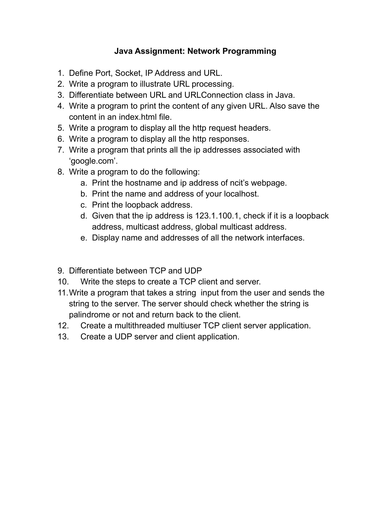
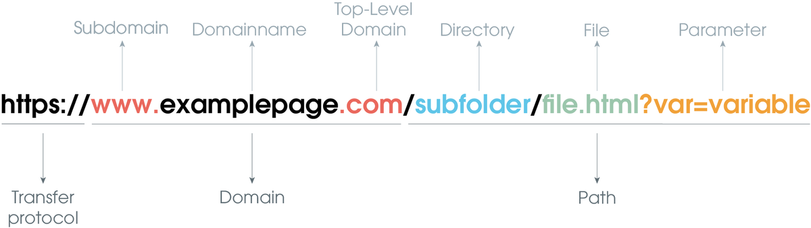

# Java Assignment: Network Programming 

# Question

# Question no.1:- Define Port, Socket, IP Address and URL.

Answer:-

   **Port :-**

   - Port is a logical construct.
      
   - Port is a number assigned to a processor running on a server
      
   - It is a 16-bit number unsigned integer range from (0-65535).

            From (0-1023), known as "system port or widely known port"

            From (1024-49159), known as "Reserved Port"

            Remaining ports(49159-65535), known as the "dynamic port or client port" used by client while connecting to server.

   - Only one application can run in a single port in a server.
      
   - Ports are used in transport layers.
      
   - Example: HTTPS:80, HTTP:443, FTP:20.

  **Socket :-**

   - Combination o fIP address and Port number is called the Socket.

   - Socket is the end point for the communication.

   - Different types of the Socket are : 

            a. TCP Socket

            b. Datagram Socket

            c. Raw Socket Interface
      
   - It works as an interface between an Application layer and Transport Layer.

   **IP Addresses :-** 

   - An IP Address is an address having information about how to reach a specific host which is a 32-bit unique address number having an address space of 2 ^ 32.
    
   - InetAddress is a class that allows us to work with the IP Addresses belongs to java.net package.

   - InetAddress is the base class of both Inet4Address(IPv4) and Inet6Address(IPv6)

   - Some of the methods present in InetAddress class are:- 

      a. public static InetAddress getByName(String host) throws UnknownHostException:-

         - It returns the instances of the InetAddress class containing the LocalHost IP and Name

      b. public static InetAddress getByAddress(byte IPAdress[]) throws UnknownHostException:-
            
         - It returns the instance of the InetAddress class created from the raw IP Address.

      c. public static InetAddress getLocalHost() throws UnknownHostException

         - It returns the instances of the InetAddress class containing the localhost name and address

      d. public static InetAddress[] getAllByName(String hostName) throws UnknownHostException

         - It returns the array of the instances of the InetAddress class which contains the IP Addresses.

Example program:- "[InetDemo.java](https://github.com/dhunganaPradeep/Java/blob/main/Assignments/Networking/InetDemo.java)"

      Output :
               Host Name: www.dhunganapradip.com.np
               IP Address: 172.67.196.125

**URL :-** 

   - It is a class that is used to represent URL
    
   - It is a package of java.net.

   - A URL is divided into many sections : 

      

Example program:- "[URLMethod.java](https://github.com/dhunganaPradeep/Java/blob/main/Assignments/Networking/URLMethod.java)"

      Output :
               1. Protocol:- https
               2. Host/Domain:- github.com
               3. Host Authority:- github.com
               4. Port:- -1
               5. Default Port:- 443
               6. Path:- /dhunganaPradeep
               7. File:- /dhunganaPradeep?tab=repositories&type=source
               8. Reference/Anchor:- null
               9. Query String:- tab=repositories&type=source
               10. URI:- https://github.com/dhunganaPradeep?tab=repositories&type=source

# Question no.2:- Write a program to process URL processing.

Answer:-

"[URLMethod.java](https://github.com/dhunganaPradeep/Java/blob/main/Assignments/Networking/URLMethod.java)"

     Output :
               1. Protocol:- https
               2. Host/Domain:- github.com
               3. Host Authority:- github.com
               4. Port:- -1
               5. Default Port:- 443
               6. Path:- /dhunganaPradeep
               7. File:- /dhunganaPradeep?tab=repositories&type=source
               8. Reference/Anchor:- null
               9. Query String:- tab=repositories&type=source
               10. URI:- https://github.com/dhunganaPradeep?tab=repositories&type=source

# Question no.3 :- Differentiate between URL and URLConnection class in java.

Answer:-

 | URL Class  | URLConnection Class |
| ------------- | ------------- |
| It represents a Uniform Resource Locator (URL) and provides methods for working with URLs.  | It represents a connection to a URL resource.  |
| It can be used to create an instance of a URL from a string representation.  | It can be used to establish a connection to a URL and obtain input and/or output streams. |
| It provides methods for accessing the components of a URL such as protocol, host, path, query, etc.  | It provides methods for setting and getting request properties such as headers, cookies, etc.  |
| It can be used to compare two URLs for equality.  | It provides methods for getting the response code, content type, and length of the resource.  |
| It provides methods for encoding and decoding URL strings.  |It supports both HTTP and HTTPS protocols. |
|It is used to open a connection to a resource identified by the URL.  | It can be used to handle redirects and authentication.  |
| It is part of the java.net package.  | It is part of the java.net package.  |
| "[URLMethod.java](https://github.com/dhunganaPradeep/Java/blob/main/Assignments/Networking/URLMethod.java)"  |  "[URLConnectionClass.java](https://github.com/dhunganaPradeep/Java/blob/main/Assignments/Networking/URLConnectionClass.java)"  |

# Question no.4:- Write a menu driven program that allows users to do following :
- # Display all the records
- # Display the total number of records
- # Ask the user to enter a name and display the number of records with the given name.
- # Display the average marks of the students.
- # Ask the user to enter a faculty and print the average marks of the students enrolled in that faculty.

Answer:- "[ConnectDb.java]()"
  

# [Assume that the table has following columns: roll, name, faculty, marks]
# Question no.5:- Write a program insert records into the above mentioned table until the user types ‘exit’.

   Answer:- "[Insert.java](https://github.com/dhunganaPradeep/Java/blob/main/Assignments/JDBC%20Assignment/Insert.java)"

# Question no.6:- Explain ResultSet, ResultSetMetaData and DatabaseMetaData.

Answer:-

   
   **1) ResultSet:** 

   - Represents the result of a query executed against a database
   - Contains rows and columns of data returned by a SELECT statement
   - Allows for iterating through the rows of data and accessing the values in each column
   - Syntax Example : 
   
         Statement stmt = conn.createStatement();
		   ResultSet rs = stmt.executeQuery("SELECT* FROM table_name");
		   while (rs.next()) {
    		int id = rs.getInt("id");
    		String name = rs.getString("name");
    		System.out.println(id + " " + name);
		      }
         

   **2) ResultSetMetaData :** 

   - Provides information about the structure of a ResultSet, such as the number of columns and the data type of each column
   - Can be used to programmatically determine the structure of a ResultSet and access metadata about the results of a query
   - Syntax Example :
   
         ResultSetMetaData rsmd = rs.getMetaData();
		   int columnCount = rsmd.getColumnCount();
		   for (int i = 1; i <= columnCount; i++) {
    		String columnName = rsmd.getColumnName(i);
   		int columnType = rsmd.getColumnType(i);
    		System.out.println(columnName + " " + columnType);
		}

   **3) DatabaseMetaData :** 

   - Provides information about the database, such as the number of tables, the names of the tables, and the data types of columns in the tables
   - Can be used to programmatically determine the structure of a database and access metadata about the database
   - Syntax Example :
   
            DatabaseMetaData dbmd = conn.getMetaData();
		   String dbName = dbmd.getDatabaseProductName();
		   String dbVersion = dbmd.getDatabaseProductVersion();
		   System.out.println(dbName + " " + dbVersion);

# Question no. 7:- Write a program to show how we can delete and updte records in a table.

Answer:- "[DatabaseOperations.java](https://github.com/dhunganaPradeep/Java/blob/main/Assignments/JDBC%20Assignment/DatabaseOperations.java)"